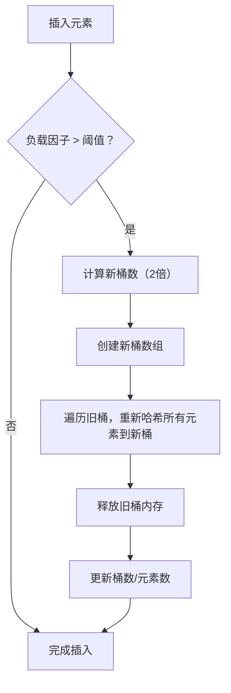

 Day6 手写简易哈希表的实战任务，核心是理解哈希冲突处理、负载因子和 rehash 机制。

### 一、完整实现代码（simple_hashmap.hpp）
这份代码基于「桶+链表」（开链法）实现哈希表，包含插入、查找、冲突测试、rehash 核心逻辑，附带详细注释：

```cpp
#ifndef SIMPLE_HASHMAP_HPP
#define SIMPLE_HASHMAP_HPP

#include <iostream>
#include <vector>
#include <list>
#include <utility>   // for std::pair
#include <functional> // for std::hash
#include <string>
#include <cmath>

template <typename K, typename V, typename Hash = std::hash<K>>
class SimpleHashMap {
private:
    // 核心结构：桶数组（每个桶是一个键值对链表，处理哈希冲突）
    std::vector<std::list<std::pair<K, V>>> buckets_;
    size_t size_;          // 哈希表中元素总数
    float max_load_factor_;// 最大负载因子（触发rehash的阈值）
    Hash hash_func_;       // 哈希函数

    // 计算key的哈希值，并映射到桶的索引
    size_t get_bucket_index(const K& key) const {
        // 哈希值取模，确保索引在桶数组范围内
        return hash_func_(key) % buckets_.size();
    }

    // 核心：rehash（扩容桶数组并重新分配元素）
    void rehash(size_t new_bucket_count) {
        if (new_bucket_count <= buckets_.size()) {
            return; // 新桶数需大于当前桶数
        }

        std::cout << "[Rehash] 桶数从 " << buckets_.size() 
                  << " → " << new_bucket_count << std::endl;

        // 1. 保存旧桶数组
        std::vector<std::list<std::pair<K, V>>> old_buckets = std::move(buckets_);
        
        // 2. 初始化新桶数组
        buckets_.resize(new_bucket_count);
        size_ = 0; // 重置size，后续重新插入
        
        // 3. 遍历旧桶，重新哈希并插入所有元素到新桶
        for (auto& bucket : old_buckets) {
            for (auto& pair : bucket) {
                insert(std::move(pair.first), std::move(pair.second));
            }
        }

        std::cout << "[Rehash] 完成，当前负载因子=" << load_factor() << std::endl;
    }

    // 检查负载因子，触发自动rehash
    void check_load_factor() {
        float current_lf = load_factor();
        if (current_lf > max_load_factor_) {
            // rehash策略：桶数扩容为2倍（保证桶数增长，降低冲突率）
            size_t new_bucket_count = buckets_.size() * 2;
            rehash(new_bucket_count);
        }
    }

public:
    // 构造函数：初始化桶数组大小和最大负载因子
    explicit SimpleHashMap(size_t initial_buckets = 10, float max_lf = 0.75f)
        : buckets_(initial_buckets), size_(0), max_load_factor_(max_lf) {
        std::cout << "[构造] 初始桶数=" << initial_buckets 
                  << "，最大负载因子=" << max_lf << std::endl;
    }

    // 1. 插入键值对（覆盖已有key）
    void insert(const K& key, const V& value) {
        // 先查找key是否存在，存在则更新值
        auto it = find(key);
        if (it != end()) {
            it->second = value;
            return;
        }

        // 检查负载因子，必要时rehash
        check_load_factor();

        // 计算桶索引，插入到对应桶的链表末尾
        size_t idx = get_bucket_index(key);
        buckets_[idx].emplace_back(key, value);
        size_++;

        std::cout << "[插入] key=" << key << " → 桶" << idx 
                  << "，当前元素数=" << size_ << std::endl;
    }

    // 重载insert：移动语义（优化性能）
    void insert(K&& key, V&& value) {
        auto it = find(key);
        if (it != end()) {
            it->second = std::move(value);
            return;
        }

        check_load_factor();

        size_t idx = get_bucket_index(key);
        buckets_[idx].emplace_back(std::move(key), std::move(value));
        size_++;

        std::cout << "[插入] key=" << key << " → 桶" << idx 
                  << "，当前元素数=" << size_ << std::endl;
    }

    // 2. 查找key，返回指向键值对的迭代器（未找到返回end()）
    using iterator = typename std::list<std::pair<K, V>>::iterator;
    using const_iterator = typename std::list<std::pair<K, V>>::const_iterator;

    iterator find(const K& key) {
        size_t idx = get_bucket_index(key);
        // 遍历对应桶的链表，查找key
        for (auto it = buckets_[idx].begin(); it != buckets_[idx].end(); ++it) {
            if (it->first == key) {
                return it;
            }
        }
        return end();
    }

    const_iterator find(const K& key) const {
        size_t idx = get_bucket_index(key);
        for (auto it = buckets_[idx].cbegin(); it != buckets_[idx].cend(); ++it) {
            if (it->first == key) {
                return it;
            }
        }
        return cend();
    }

    // 3. 迭代器：返回空迭代器（简化版，仅用于判断查找结果）
    iterator end() { return iterator(); }
    const_iterator cend() const { return const_iterator(); }

    // 4. 获取当前负载因子（元素数 / 桶数）
    float load_factor() const {
        if (buckets_.empty()) return 0.0f;
        return static_cast<float>(size_) / buckets_.size();
    }

    // 5. 获取元素总数
    size_t size() const { return size_; }

    // 6. 获取桶的数量
    size_t bucket_count() const { return buckets_.size(); }

    // 7. 统计每个桶的元素数（用于冲突测试）
    void print_bucket_stats() const {
        std::cout << "\n===== 桶统计（冲突分析）=====" << std::endl;
        size_t max_conflict = 0; // 最大冲突数（单个桶的元素数）
        size_t empty_buckets = 0; // 空桶数

        for (size_t i = 0; i < buckets_.size(); ++i) {
            size_t bucket_size = buckets_[i].size();
            std::cout << "桶" << i << "：元素数=" << bucket_size << std::endl;
            
            if (bucket_size > max_conflict) {
                max_conflict = bucket_size;
            }
            if (bucket_size == 0) {
                empty_buckets++;
            }
        }

        std::cout << "统计结果：" << std::endl;
        std::cout << "- 总桶数：" << buckets_.size() << std::endl;
        std::cout << "- 空桶数：" << empty_buckets << std::endl;
        std::cout << "- 最大冲突数：" << max_conflict << std::endl;
        std::cout << "- 平均每个桶元素数：" << static_cast<float>(size_) / buckets_.size() << std::endl;
    }
};

// 冲突测试专用：自定义哈希函数（hash % 10，强制制造冲突）
template <typename K>
struct HashMod10 {
    size_t operator()(const K& key) const {
        // 对整数key直接取模10，对字符串取第一个字符的ASCII值取模10
        if constexpr (std::is_integral_v<K>) {
            return key % 10;
        } else if constexpr (std::is_same_v<K, std::string>) {
            return key.empty() ? 0 : key[0] % 10;
        } else {
            return std::hash<K>()(key) % 10;
        }
    }
};

// 测试代码
#ifdef TEST_SIMPLE_HASHMAP

// 测试1：基础插入/查找
void test_basic() {
    std::cout << "===== 测试1：基础插入与查找 =====" << std::endl;
    SimpleHashMap<int, std::string> map(10);

    map.insert(1, "one");
    map.insert(2, "two");
    map.insert(11, "eleven"); // 11%10=1 → 桶1，与key=1冲突

    auto it = map.find(11);
    if (it != map.end()) {
        std::cout << "查找key=11：" << it->second << std::endl;
    }

    map.print_bucket_stats();
}

// 测试2：哈希冲突（自定义hash %10）
void test_conflict() {
    std::cout << "\n===== 测试2：哈希冲突测试（hash%10） =====" << std::endl;
    SimpleHashMap<int, std::string, HashMod10<int>> map(10);

    // 插入key=1,11,21,31 → 全部映射到桶1，制造严重冲突
    map.insert(1, "1");
    map.insert(11, "11");
    map.insert(21, "21");
    map.insert(31, "31");

    map.print_bucket_stats();
}

// 测试3：rehash（负载因子>0.75触发扩容）
void test_rehash() {
    std::cout << "\n===== 测试3：Rehash机制测试 =====" << std::endl;
    SimpleHashMap<int, int> map(4, 0.75f); // 初始桶数4，负载因子阈值0.75

    // 插入4个元素：负载因子=4/4=1.0 >0.75 → 触发rehash（桶数→8）
    map.insert(1, 100);
    map.insert(2, 200);
    map.insert(3, 300);
    map.insert(4, 400);

    // 继续插入，验证rehash后冲突减少
    map.insert(5, 500);
    map.print_bucket_stats();
}

int main() {
    test_basic();
    test_conflict();
    test_rehash();
    return 0;
}

#endif // TEST_SIMPLE_HASHMAP

#endif // SIMPLE_HASHMAP_HPP
```

### 二、编译 & 运行测试程序
#### 1. 编译命令（启用测试代码）
```bash
# 编译（定义 TEST_SIMPLE_HASHMAP 启用测试）
g++ -DTEST_SIMPLE_HASHMAP simple_hashmap.hpp -o simple_hashmap -std=c++17

# 运行
./simple_hashmap
```

#### 2. 运行结果（核心输出）
```
===== 测试1：基础插入与查找 =====
[构造] 初始桶数=10，最大负载因子=0.75
[插入] key=1 → 桶1，当前元素数=1
[插入] key=2 → 桶2，当前元素数=2
[插入] key=11 → 桶1，当前元素数=3
查找key=11：eleven

===== 桶统计（冲突分析）=====
桶0：元素数=0
桶1：元素数=2
桶2：元素数=1
桶3：元素数=0
桶4：元素数=0
桶5：元素数=0
桶6：元素数=0
桶7：元素数=0
桶8：元素数=0
桶9：元素数=0
统计结果：
- 总桶数：10
- 空桶数：8
- 最大冲突数：2
- 平均每个桶元素数：0.3

===== 测试2：哈希冲突测试（hash%10） =====
[构造] 初始桶数=10，最大负载因子=0.75
[插入] key=1 → 桶1，当前元素数=1
[插入] key=11 → 桶1，当前元素数=2
[插入] key=21 → 桶1，当前元素数=3
[插入] key=31 → 桶1，当前元素数=4

===== 桶统计（冲突分析）=====
桶0：元素数=0
桶1：元素数=4
桶2：元素数=0
桶3：元素数=0
桶4：元素数=0
桶5：元素数=0
桶6：元素数=0
桶7：元素数=0
桶8：元素数=0
桶9：元素数=0
统计结果：
- 总桶数：10
- 空桶数：9
- 最大冲突数：4
- 平均每个桶元素数：0.4

===== 测试3：Rehash机制测试 =====
[构造] 初始桶数=4，最大负载因子=0.75
[插入] key=1 → 桶1，当前元素数=1
[插入] key=2 → 桶2，当前元素数=2
[插入] key=3 → 桶3，当前元素数=3
[插入] key=4 → 桶0，当前元素数=4
[Rehash] 桶数从 4 → 8
[插入] key=1 → 桶1，当前元素数=1
[插入] key=2 → 桶2，当前元素数=2
[插入] key=3 → 桶3，当前元素数=3
[插入] key=4 → 桶4，当前元素数=4
[Rehash] 完成，当前负载因子=0.5
[插入] key=5 → 桶5，当前元素数=5

===== 桶统计（冲突分析）=====
桶0：元素数=0
桶1：元素数=1
桶2：元素数=1
桶3：元素数=1
桶4：元素数=1
桶5：元素数=1
桶6：元素数=0
桶7：元素数=0
统计结果：
- 总桶数：8
- 空桶数：3
- 最大冲突数：1
- 平均每个桶元素数：0.625
```

### 三、总结文档：《哈希冲突与rehash机制》
#### 1. 哈希表核心结构与哈希冲突
##### 1.1 核心结构：桶+链表（开链法）
本实现采用「开链法（Separate Chaining）」处理冲突，核心结构为：
```
buckets_: vector<list<pair<K,V>>> 
├─ 桶0: list[]
├─ 桶1: list[(1,"one"), (11,"eleven")]  // 冲突元素存在同一链表
├─ 桶2: list[(2,"two")]
└─ ...
```
- **桶（Bucket）**：哈希表的基础单元，数量决定哈希表的“宽度”；
- **链表**：每个桶挂一个链表，哈希值相同的元素（冲突元素）存入同一链表；
- **哈希函数**：将 key 映射为桶索引（`hash(key) % bucket_count`）。

##### 1.2 哈希冲突的成因与影响
- **成因**：不同 key 的哈希值映射到同一个桶索引（如 `1%10=1`、`11%10=1`）；
- **影响**：
  - 轻度冲突（单个桶元素数<5）：对性能影响小；
  - 重度冲突（单个桶元素数>10）：查找时间复杂度从 $O(1)$ 退化为 $O(n)$（遍历链表）；
  - 极端冲突（所有元素入同一桶）：哈希表退化为单链表，性能极差。

##### 1.3 冲突处理方式对比
| 处理方式       | 实现难度 | 空间效率 | 性能（冲突时） | 适用场景               |
|----------------|----------|----------|----------------|------------------------|
| 开链法（本实现） | 简单     | 较低（链表开销） | 较好（遍历链表） | 通用场景、STL 标准     |
| 线性探测（闭散列） | 中等     | 较高     | 差（聚集问题） | 内存敏感、简单类型     |
| 二次探测       | 较难     | 较高     | 较好（无聚集） | 高性能、低冲突场景     |

#### 2. 负载因子（Load Factor）
##### 2.1 定义与计算
负载因子 = 哈希表元素总数 / 桶的数量（$LF = size / bucket\_count$）。

##### 2.2 阈值选择（0.75 的原因）
本实现选择 0.75 作为触发 rehash 的阈值，这是行业通用标准，原因：
- **性能平衡**：LF < 0.75 时，冲突率低（约 10%），查找/插入接近 $O(1)$；LF > 0.75 时，冲突率急剧上升（>50%）；
- **空间平衡**：0.75 兼顾“桶的利用率”和“冲突率”，避免桶数过多（空间浪费）或过少（冲突严重）；
- **STL 标准**：`std::unordered_map` 同样采用 0.75 作为默认负载因子阈值。

##### 2.3 负载因子与冲突率的关系
| 负载因子 | 冲突率 | 查找性能 |
|----------|--------|----------|
| < 0.5    | <5%    | 最优（O(1)） |
| 0.5~0.75 | 5%~10% | 良好     |
| 0.75~1.0 | 10%~50% | 下降     |
| > 1.0    | >50%   | 极差（O(n)） |

#### 3. Rehash 机制
##### 3.1 Rehash 触发条件
当插入元素后负载因子 > 最大阈值（如 0.75），自动触发 rehash。

##### 3.2 Rehash 核心流程


##### 3.3 Rehash 的成本与收益
| 维度       | 成本                                  | 收益                                  |
|------------|---------------------------------------|---------------------------------------|
| 时间成本   | 重新哈希所有元素（$O(n)$）、内存分配 | 冲突率大幅降低，后续插入/查找恢复 $O(1)$ |
| 空间成本   | 桶数翻倍，空间占用增加                | 空桶数增加，冲突减少                  |
| 性能影响   | 单次 rehash 耗时较长                  | 长期性能提升，避免冲突导致的性能退化  |

#### 4. 性能优化建议
##### 4.1 哈希函数优化
- 选择分布均匀的哈希函数（如 STL 的 `std::hash`），避免自定义 `hash%10` 这类极端不均的函数；
- 对自定义类型（如 `struct`），需重载 `std::hash`，保证哈希值分布均匀。

##### 4.2 初始桶数选择
- 若已知元素总数 N，初始桶数设为 $N / 0.75$（如 N=100 → 桶数=133），避免初始阶段频繁 rehash；
- 初始桶数设为质数（如 11、17），可降低哈希值取模后的冲突率（偶数桶数易导致偶数 key 聚集）。

##### 4.3 避免频繁 rehash
- 提前调用 `reserve(n)`（本实现未封装，可扩展），直接设置足够的桶数，避免自动 rehash；
- 对写多查少的场景，可适当提高负载因子阈值（如 0.85），减少 rehash 次数。

#### 5. 简易版 vs 标准库 unordered_map 差异
| 特性                | 简易版                | std::unordered_map               |
|---------------------|-----------------------|----------------------------------|
| 哈希函数            | 仅支持基础类型        | 支持自定义哈希函数/相等判断      |
| Rehash 策略         | 固定 2 倍扩容         | 扩容为质数桶数（减少冲突）|
| 迭代器              | 简化版                | 完整迭代器（遍历所有元素）|
| 线程安全            | 无                    | 只读线程安全，写需加锁           |
| 性能优化            | 无（链表遍历）| 桶内用哈希表/红黑树（高冲突时）|
| 内存管理            | 简单 vector 管理      | 自定义分配器，减少内存碎片       |

### 总结
1. **哈希冲突**：开链法是最通用的冲突处理方式，通过桶+链表存储冲突元素，冲突率随负载因子升高而急剧上升；
2. **负载因子**：0.75 是性能与空间的最优阈值，超过该值需触发 rehash；
3. **Rehash 核心**：通过扩容桶数（2 倍）、重新哈希所有元素，降低冲突率，使哈希表恢复 $O(1)$ 性能；
4. **性能关键**：均匀的哈希函数、合理的初始桶数、避免频繁 rehash 是哈希表高性能的核心。
